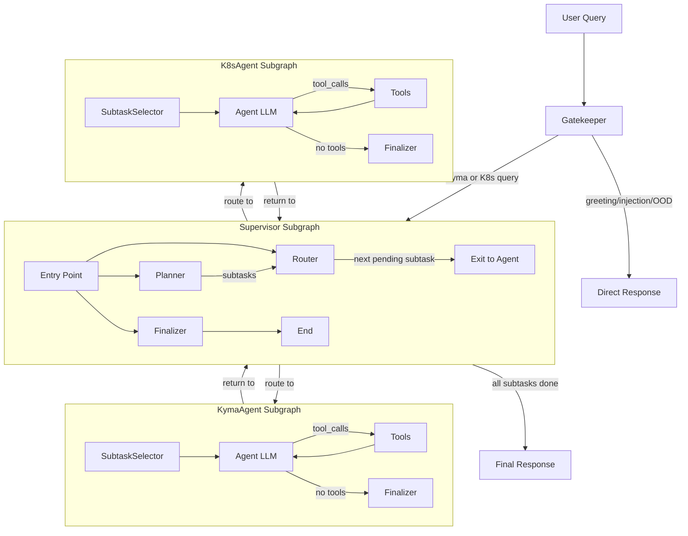
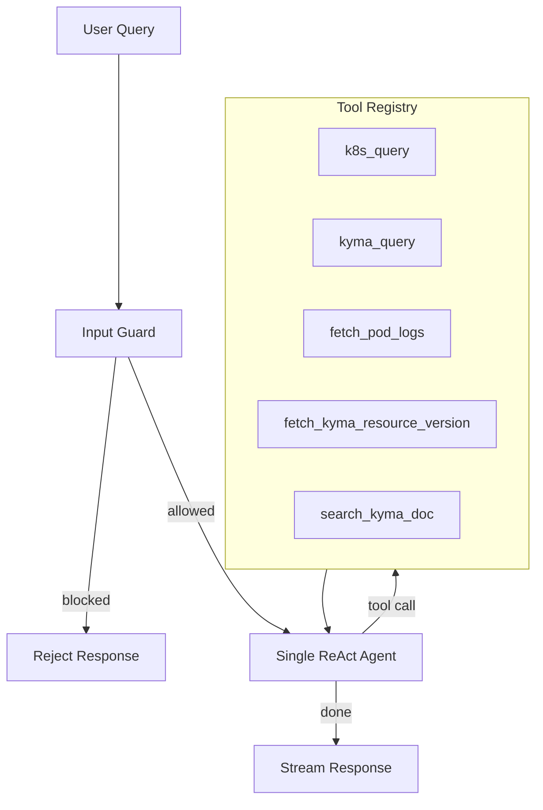
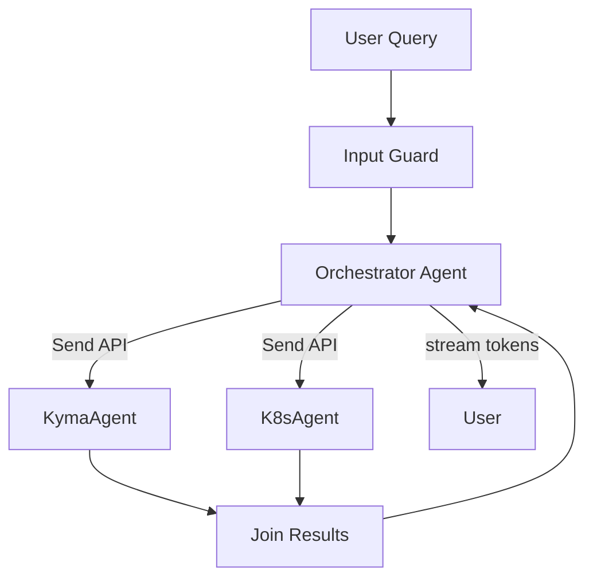

# Architecture Review: Kyma Companion AI Assistant

## Current Architecture

The system is a Kyma/Kubernetes AI assistant built with LangGraph. The workflow is:

1. **Gatekeeper** (entry point) -- classifies queries, detects prompt injection, handles greetings and out-of-domain queries.
2. **Supervisor** (subgraph with Planner, Router, Finalizer) -- breaks queries into subtasks, routes to agents, synthesizes a final response.
3. **KymaAgent** -- handles Kyma-specific queries with tools (`kyma_query`, `fetch_kyma_resource_version`, `search_kyma_doc`).
4. **KubernetesAgent** -- handles K8s queries with tools (`k8s_query`, `fetch_pod_logs`).

### Key Technologies

- **LangGraph** (>=1.0.10) for workflow orchestration
- **LangChain** (>=1.2.10) for prompt templates and chain abstractions
- **GPT-4.1** as the main model, **GPT-4o-mini** for the Supervisor/Planner
- **RAG** via embeddings (`text-embedding-3-large`) for Kyma documentation search
- **Redis** checkpointer for conversation memory
- **Langfuse** for observability

---

## What's Well-Designed

### 1. Security-first entry point

The Gatekeeper performs prompt injection and security threat detection before any work happens. This is still a recommended practice in 2026.

### 2. Clean domain separation

KymaAgent and KubernetesAgent each own their tools and prompts. The `BaseAgent` abstraction in `src/agents/common/agent.py` provides a solid contract for all worker agents.

### 3. Nested subgraphs

Each agent is a compiled `StateGraph` embedded as a node in the parent graph. This gives proper state isolation and makes recursion limits per-agent rather than global.

### 4. RAG integration

The `SearchKymaDocTool` using embeddings + retrieval is the right pattern for domain knowledge augmentation.

### 5. Structured tool injection

Using `InjectedState("k8s_client")` to pass the Kubernetes client into tools without exposing it to the LLM is clean and avoids leaking internal state.

---

## Architectural Issues

### 1. Excessive LLM calls per query (minimum 4)

Every query that reaches an agent requires at least:

| Step | LLM Call | Node |
|------|----------|------|
| 1 | Gatekeeper classification | `_gatekeeper_node` |
| 2 | Planner decomposition | `_plan` |
| 3 | Agent tool-calling loop | `_model_node` (1+ calls) |
| 4 | Finalizer synthesis | `_generate_final_response` |

For a simple query like "what's wrong with my pod?", that's 4 LLM round-trips before the user sees anything. Modern models (GPT-4.1, which is already the main model here) are capable of handling classification, planning, and execution in a single ReAct loop.

### 2. Sequential subtask execution

The Router dispatches one subtask at a time, returning to Supervisor after each agent completes. For a query like "show pods and Kyma functions", KymaAgent and KubernetesAgent run in series, doubling latency. LangGraph's `Send()` API supports parallel fan-out but is not used.

### 3. The Gatekeeper is overloaded

`GatekeeperResponse` asks a single LLM call to produce 7+ distinct outputs simultaneously:

- `forward_query` (bool)
- `is_prompt_injection` (bool)
- `is_security_threat` (bool)
- `user_intent` (str)
- `category` (Literal)
- `direct_response` (str)
- `is_user_query_in_past_tense` (bool)
- `answer_from_history` (str)

Structured output accuracy degrades as the number of fields grows, especially when fields have complex conditional dependencies (e.g., "only populate `answer_from_history` if `is_user_query_in_past_tense` is true AND `category` is Kyma/Kubernetes").

### 4. Static plan-then-execute is rigid

The Planner creates all subtasks upfront, then the Router executes them without adaptation. If the first subtask reveals information that changes what the second subtask should do, there's no feedback loop. The agent can't say "I found something unexpected, let me adjust the plan."

### 5. Agents can't collaborate

KymaAgent and KubernetesAgent have no way to share intermediate findings. Each gets its subtask description as a string, executes independently, and only the Finalizer sees all results. If diagnosing a Kyma Function failure requires checking the underlying Pod (K8s domain), the system can't do that within a single agent turn.

### 6. No token-level streaming

The `astream` method yields serialized graph state chunks (entire node outputs), not token-by-token LLM output. Users see nothing until an entire agent finishes its ReAct loop and the Finalizer completes.

### 7. Heavy abstraction layering

The chain creation pattern uses LangChain's `ChatPromptTemplate | model.llm.with_structured_output()` piping everywhere. In 2026, with native structured output support in model APIs (OpenAI, Anthropic, SAP GenAI Hub), this adds indirection without adding value.

---

## Recommendations for a 2026 AI Assistant

### Option A: Simplified Single-Agent Architecture (Recommended)

The industry consensus in 2025-2026 has shifted toward fewer, more capable agents rather than multi-agent orchestration. GPT-4.1 handles tool selection, planning, and execution natively.

Key changes:

- **Input Guard**: lightweight classifier or rule-based filter for prompt injection (can be a separate small model call or a dedicated guardrail library).
- **Single agent** with all 5 tools available, using native tool-calling.
- **No Planner, no Router, no Finalizer** -- the model handles all of this naturally in its ReAct loop.
- **Token streaming** from the single agent directly to the user.
- Latency drops from 4+ LLM calls to 1-2 (agent + tool calls).

### Option B: Improved Multi-Agent (if domain separation is a hard requirement)

If separate agents must be kept (e.g., for access control, separate model configs, or team ownership boundaries):

Key improvements over current design:

- **Replace Planner + Router + Finalizer** with a single Orchestrator that uses LangGraph's `Send()` for parallel fan-out.
- **Parallel agent execution** -- KymaAgent and K8sAgent run concurrently.
- **Dynamic replanning** -- Orchestrator can send follow-up tasks based on agent results.
- **Stream the Orchestrator's final synthesis** token-by-token.

---

## Additional Recommendations (applicable to both options)

### Split the Gatekeeper into focused guards

Replace the monolithic `GatekeeperResponse` with:
- A fast classifier for category routing.
- A separate prompt-injection detector (or use a dedicated guardrail like Rebuff, NeMo Guardrails, or even a regex pre-filter for obvious attacks).

### Use LangGraph's `interrupt()` / `Command()`

For operations that might need user confirmation (e.g., before making changes to cluster resources), use the built-in human-in-the-loop primitives instead of managing it in state.

### Consider dropping LangChain chains

Replace `ChatPromptTemplate | model.llm.with_structured_output()` with direct `model.invoke()` calls using LangGraph's native message handling. This reduces the dependency surface and simplifies debugging.

### Add structured observability

Langfuse integration exists, but structured trace spans per-node (not just callbacks) would help debug the multi-hop flows. Consider using LangGraph's built-in tracing with LangSmith or equivalent.

### Use a tool-use planner instead of structured-output planner

Instead of generating a `Plan` object with `with_structured_output`, let the orchestrator use a `create_plan` tool. This lets the model reason in its chain-of-thought before committing to a plan, improving quality.
