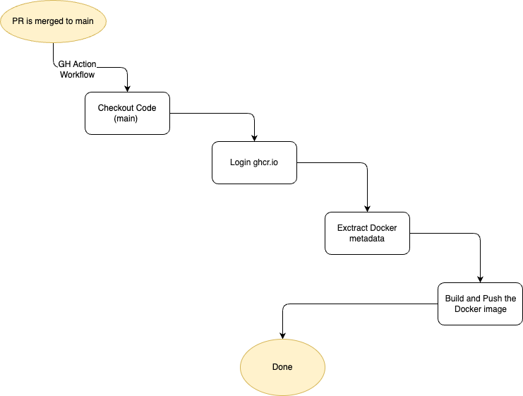

# Backend - Release Workflow Documentation

This documentation provides a step-by-step guide to the release process workflow for building and pushing a Go project using GitHub Actions. This workflow is triggered on pushes to the `main` branch and tags, specifically for changes within the `assistant/backend` directory.


## Prerequisites

- PR to the `main` branch:
    - label: `lgtm`
    - Approved by at least one reviewer
    - Passes all checks (Bckend E2E tests, Linting, Git Leaks)


## Workflow Overview

The workflow performs the following key steps:

- Trigger the workflow on push events to the `main` branch and tags.
- Set up environment variables.
- Check out the code from the repository.
- Log in to the Docker registry.
- Extract Docker metadata.
- Build and push the Docker image.

## Workflow Details



### Workflow Trigger

The workflow is triggered by:

- Push events to the `main` branch.
- Tags matching the pattern `*.*.*`.
- Changes within the `assistant/backend` directory.

```yaml
on:
  push:
    branches: ["main"]
    tags: ["*.*.*"]
    paths:
      - "assistant/backend/**"
```

### Environment Variables

Define the following environment variables:

IMAGE_REGISTRY: The Docker image registry (e.g., ghcr.io).
ORGANIZATION: The organization name (e.g., kyma-project).
REPOSITORY_NAME: The repository name (e.g., kyma-companion).
IMAGE_NAME: The Docker image name (e.g., ai-backend).

```yaml
env:
  IMAGE_REGISTRY: ghcr.io
  ORGANIZATION: kyma-project
  REPOSITORY_NAME: kyma-companion
  IMAGE_NAME: ai-backend
```

### Job Configuration

The job build runs on the latest Ubuntu environment with write permissions.

```yaml
jobs:
  build:
    runs-on: ubuntu-latest
    permissions: write-all
    steps:
```

### Steps in the Job

**1. Checkout Code**

Check out the code from the repository.

```yaml
- name: Checkout code
  uses: actions/checkout@v4
```

**2. Log into Registry**

Log into the Docker registry using the provided credentials.

```yaml

- name: Log into registry ${{ env.IMAGE_REGISTRY }}
  uses: docker/login-action@v3
  with:
    registry: ${{ env.IMAGE_REGISTRY }}
    username: ${{ secrets.GH_CR_USER }}
    password: ${{ secrets.GH_CR_PAT }}
```

**3. Extract Docker Metadata**

Extract metadata for the Docker image, including tags and labels.

```yaml
- name: Extract Docker metadata
  id: meta
  uses: docker/metadata-action@v5
  with:
    images: ${{ env.IMAGE_REGISTRY }}/${{ env.ORGANIZATION }}/${{ env.REPOSITORY_NAME }}/${{ env.IMAGE_NAME }}
    tags: |
      type=sha
      type=raw,value=latest,event=push
      type=semver,pattern={{version}},event=tag
```

**4. Build and Push Docker Image**

Build and push the Docker image using the specified build arguments, context, and Dockerfile.

```yaml
- name: Build and push Docker image
  id: build-and-push
  uses: docker/build-push-action@v5
  with:
    push: true
    context: ./assistant/backend
    file: ./assistant/backend/Dockerfile
    build-args: |
      JFROG_USER=${{ secrets.JFROG_IDENTITY_USER }}
      JFROG_TOKEN=${{ secrets.JFROG_IDENTITY_TOKEN }}
    platforms: linux/amd64
    tags: ${{ steps.meta.outputs.tags }}
    labels: ${{ steps.meta.outputs.labels }}
```

## Conclusion

This documentation outlines the steps to set up and run the release process workflow for your backend service. Ensure that all the required secrets and configurations are properly set in your GitHub repository for the workflow to execute successfully. If you encounter any issues, review the logs for each step to identify and resolve errors.

