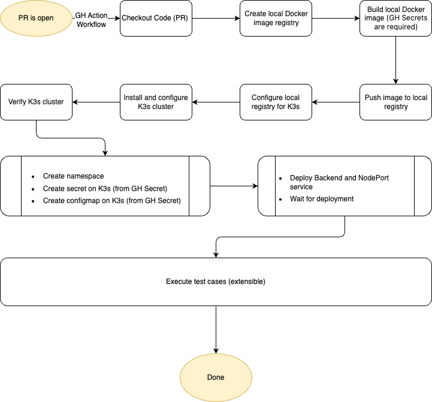

# Documentation for Setting Up and Running the Release Testing GitHub Action

This documentation provides a step-by-step guide to setting up and running the release testing GitHub Action for your backend's end-to-end (E2E) testing. Follow these steps to ensure your CI/CD pipeline is correctly configured and executed.

## Overview

The GitHub Action is triggered on pull requests to the `main` branch within the `assistant/backend` directory. The workflow sets up a local Docker image registry, builds and pushes a Docker image, configures and installs a K3s cluster, deploys the image to the cluster, and performs health checks and resource tests.

## Files and folders

- GitHub Action Workflow: `.github/workflows`
- Backend code: `assistant/backend`
- Kubernetes related scripts and deployment files: `.scripts/kubernetes`
- Shell scripts (k3s installation, deployment verification, test scripts): `.scripts/shell`

## Secrets

- Secret for Backend (K3S_SECRET)
- Configmap for Backend (K3S_CONFIGMAP)
- User for `sap-llm-commons` (JFROG_IDENTITY_USER)
- Token for `sap-llm-commons` (JFROG_IDENTITY_TOKEN)
- GitHub PAT user for container registry (GH_CR_USER) - requires for release process
- GitHub PAT token for container registry (GH_CR_PAT) - requires for release process


## Workflow Steps



### 1. Workflow Trigger

The workflow is triggered by:

- Push events to the `main` branch.
- Pull request events targeting the `main` branch.

The paths filter ensures that only changes within the `assistant/backend` directory trigger the workflow.

```yaml
on:
  pull_request_target:
    branches:
      - main
    paths:
      - "assistant/backend/**"
```

We use `pull_request_target` to run the workflow on the base branch of the pull request. This allows us to access the base branch's secrets and environment variables.

### 2. Environment Variables

A Docker timeout environment variable is set to 30 seconds.

```yaml
env:
  DOCKER_TIMEOUT: 30
```

### 3. Job Configuration

The job `build` is configured to run on the latest Ubuntu environment with write permissions.

```yaml
jobs:
  build:
    name: Backend E2E test
    runs-on: ubuntu-latest
    permissions: write-all
    steps:
```

### 4. Steps in the Job

Steps in `.github/workflows/backend-e2e-test.yaml`:

- Get the code (PR)
- Create local Docker image registry
- Build local Docker image
- Push image to local registry
- Configure K3s for local Docker image registry
- Install and configure K3s cluster
- Verify K3s cluster
- Deploy - Create namespace
- Deploy - Create Secret for backend
- Deploy - Create ConfigMap for backend
- Deploy - Create Backend and NodePort service
- Deploy - Wait for deployment
- Test - Health check
- Test - Cluster resources

#### Step 4.1: Checkout Code

Checkout the code from the repository. (PR version)

```yaml
- name: Prep - Checkout code
  uses: actions/checkout@v4
  with:
    ref: ${{ github.event.pull_request.head.ref }}
    repository: ${{ github.event.pull_request.head.repo.full_name }}
```

#### Step 4.2: Create Local Docker Image Registry

Create a local Docker image registry.

```yaml
- name: Prep - Local Image registry
  run: |
    docker run -d -p 5000:5000 --restart=always --name registry registry:2
```

#### Step 4.3: Build Local Docker Image

Build the Docker image using the provided JFrog credentials.

```yaml
- name: Build - Docker image
  working-directory: ./assistant/backend
  run: |
    docker build --build-arg "JFROG_USER=${{ secrets.JFROG_IDENTITY_USER }}" --build-arg "JFROG_TOKEN=${{ secrets.JFROG_IDENTITY_TOKEN }}" -t ai-backend .
```

#### Step 4.4: Check Docker Image

Verify the Docker image creation.

```yaml
- name: Build - Check Docker image
  run: docker images ai-backend
```

#### Step 4.5: Push Image to Local Registry

Tag and push the Docker image to the local registry.

```yaml
- name: Publish - Push image to local registry
  run: |
    docker tag ai-backend:latest localhost:5000/ai-backend:latest
    docker push localhost:5000/ai-backend:latest
```

#### Step 4.6: Configure Local Registry for K3s

Copy the local registry configuration for K3s.

```yaml
- name: K3s - Configure local registry for k3s
  run: |
    mkdir -p ~/.k3s
    cp .scripts/kubernetes/registries.yaml ~/.k3s/registries.yaml
```

#### Step 4.7: Install and Configure K3s Cluster

Install and configure the K3s cluster using a shell script.

```yaml
- name: K3s - Install and configure K3s cluster
  run: .scripts/shell/k3s-installation.sh
```

#### Step 4.8: Verify K3s Cluster

Verify the K3s cluster by checking nodes and namespaces.

```yaml
- name: K3s - Verify K3s cluster
  run: |
    kubectl get nodes
    kubectl get ns
```

#### Step 4.9: Create Namespace

Create the namespace for the deployment.

```yaml
- name: Deploy - Create namespace
  run: |
    kubectl apply -f .scripts/kubernetes/ai-backend-namespace.yaml
```

#### Step 4.10: Create Secret

Create a secret in the K3s cluster.

```yaml
- name: Deploy - Create secret on K3s
  run: |
    echo "${{ secrets.K3S_SECRET }}" > .scripts/kubernetes/ai-backend-secret.yaml
    kubectl apply -f .scripts/kubernetes/ai-backend-secret.yaml
    rm -f .scripts/kubernetes/ai-backend-secret.yaml
```

#### Step 4.11: Create ConfigMap

Create a configmap in the K3s cluster.

```yaml
- name: Deploy - Create configmap on K3s
  run: |
    echo "${{ secrets.K3S_CONFIGMAP }}" > .scripts/kubernetes/ai-backend-configmap.yaml
    kubectl apply -f .scripts/kubernetes/ai-backend-configmap.yaml
    rm -f .scripts/kubernetes/ai-backend-configmap.yaml
```

#### Step 4.12: Deploy Pod and Service

Deploy the Docker image and create a NodePort service.

```yaml
- name: Deploy - Create Backend and NodePort service
  run: |
    kubectl apply -f .scripts/kubernetes/ai-backend-deployment.yaml
```

#### Step 4.13: Wait for Deployment

Wait for the deployment to complete using a shell script.

```yaml
- name: Deploy - Wait for deployment
  run: .scripts/shell/deploy-wait-for-deployment.sh $DOCKER_TIMEOUT
```

#### Step 4.14: Health Check

Perform a health check on the backend.

```yaml
- name: Test - Health check
  run: .scripts/shell/test-health-check.sh
```

#### Step 4.15: Resources Check

Check the resources in the cluster.

```yaml
- name: Test - Cluster resources
  run: .scripts/shell/test-api-v1-resources.sh
```

## Conclusion

This documentation outlines the steps to set up and run the release testing GitHub Action for your backend service. Ensure that all the required scripts and secrets are properly configured in your repository for the workflow to execute successfully. If you encounter any issues, review the logs for each step to identify and resolve errors.