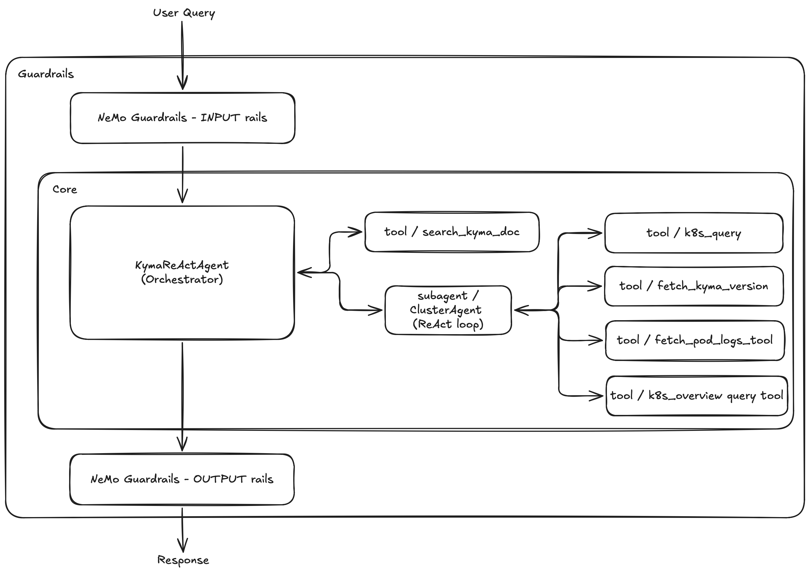

# Proposal: Orchestrator + ClusterAgent with Guardrails

## Context

This proposal is the synthesis of two existing proposals and a validated PoC, building directly on all three:

- [Simplification](https://github.tools.sap/kyma/ai-force/pull/411) removes the Supervisor, SubTask routing, Common agent, and multi-subgraph overhead in favor of a single ReAct loop. The right foundation, with Phase 1 (Common agent removal) already validated in [PR #1107](https://github.com/kyma-project/kyma-companion/pull/1107).
- [Orchestrator + Specialists](https://github.tools.sap/kyma/ai-force/pull/417) reintroduces domain specialists as sub-agents-as-tools for context isolation, a cheaper model tier, and parallelism, at domain granularity rather than task granularity. The right long-term shape, but costly if applied naively to every query.
- [PR #1247](https://github.com/kyma-project/kyma-companion/pull/1247) introduces `KymaReActAgent`, a working PoC deployed at `/api/agent/kyma` via the A2A protocol. It validates the `create_agent` two-node ReAct loop for Kyma queries with cluster tools and RAG (`SearchKymaDocTool`), but does **not** include Guardrails or ClusterAgent, confirming the concrete gaps this proposal addresses.

This proposal ties all three together: a NeMo Guardrails front door for security, a per-request Orchestrator in a ReAct loop with all cluster tools and RAG directly attached, and a ClusterAgent sub-agent for deep diagnostics.

## Why Simplification Alone Is Not Enough

`KymaReActAgent` (PR #1247) proves the single ReAct loop works, but three gaps remain:

- **Context overload on complex queries.** All tool calls accumulate in one context window. Multi-resource cluster diagnostics can dump hundreds of resources of raw YAML into the agent's working memory, degrading model performance and response quality.
- **RAG without full context.** Delegating documentation retrieval to a sub-agent means that agent only receives a stripped query, lacking the cluster state and conversation context the Orchestrator has. The result is generic documentation retrieval rather than targeted, situation-aware answers.
- **No security layer.** The PoC has no Guardrails, so prompt injection detection and off-domain filtering are absent.

This proposal addresses all three.

## Proposed Architecture

### Guardrails Front Door (replaces the Gatekeeper)

[NeMo Guardrails](https://docs.nvidia.com/nemo/guardrails) runs as a **pre- and post-request filter**, not as a graph node. Safety concerns are deliberately decoupled from agent functionality, so the Orchestrator focuses purely on answering queries, while Guardrails owns security as a separate responsibility. Using an established open-source safety layer means threat coverage improves as the community updates its rails, without any maintenance burden on this codebase. Input rails handle prompt-injection detection, security-threat blocking, and off-domain rejection. Output rails handle malicious-payload filtering, preserving legitimate educational security content.

The current LLM-based Gatekeeper node is removed entirely.

### Orchestrator (the evolved KymaAgent)

The Orchestrator holds direct connections to all tools, both cluster tools and RAG, while also being able to spawn sub-agents for heavy work. This hybrid design is the key architectural choice of this proposal, for the following reasons.

**Direct access to RAG.** The Orchestrator is the only agent that has the full picture of what the user is asking and what the cluster state looks like. A separate knowledge sub-agent would only receive a delegated query string, stripped of that context, and could not know what to look for, what is relevant, or whether a retrieved result actually applies to the observed problem. Keeping RAG as a direct tool on the Orchestrator means documentation is retrieved at exactly the right moment, with the right context, without a round-trip through a sub-agent.

**Direct access to cluster tools for simple tasks.** For straightforward lookups, such as a single resource, a pod's logs, or a resource version, the Orchestrator calls the cluster tools directly. The result is added to its context and the answer follows immediately, with no delegation, no extra hop, and no added latency.

**ClusterAgent for complex diagnostics.** When a query requires inspecting many resources, correlating state across the cluster, or iterating through multiple tool calls, the Orchestrator delegates to a ClusterAgent sub-agent. This is the critical isolation: unbounded YAML dumps and multi-step cluster exploration happen in the sub-agent's own context window, not the Orchestrator's. An overloaded context degrades model performance, so keeping the Orchestrator's context lean and focused is what keeps response quality consistent under complex queries.

The decision to call a tool directly or spawn a ClusterAgent is made by the Orchestrator as ordinary tool selection, with no separate planning step and no routing node.

### ClusterAgent

A sub-agent-as-tool with its own ReAct loop and context window. It keeps unbounded YAML dumps out of the Orchestrator's context and runs heavy cluster work on a cheaper model, returning a structured summary to the Orchestrator.

**One ClusterAgent, not several.** Cluster tools are the same underlying operation (a Kubernetes API GET differing only in URI), and diagnostic workflows are naturally sequential and correlated. Additional specialists should be added only when a domain genuinely justifies its own context and model tier.

## Advantages

- **RAG with full context.** Documentation retrieval happens directly on the Orchestrator, where the full picture of the query and cluster state is available, with no sub-agent hop, no context loss, and no round-trip.
- **Simple tasks stay simple.** Direct cluster tools on the Orchestrator handle single-resource lookups without delegation, with low latency and no overhead.
- **Complex tasks stay contained.** ClusterAgent isolates multi-step cluster exploration in its own context window. The Orchestrator's context stays lean, which preserves model performance under heavy queries.
- **Security decoupled from agent logic.** NeMo Guardrails owns safety as a separate layer, so the Orchestrator focuses purely on answering queries. Threat coverage improves with community updates, without touching the agent codebase.
- **No state machinery.** The Supervisor graph, SubTask state machine, per-agent state classes, and `InjectedState` all disappear. The k8s_client is a closure bound at construction time.
- **Extensible.** New specialists register as tools on the Orchestrator, and the topology does not change.

## Related

- Simplification proposal: [kyma-companion-simplification](https://github.tools.sap/kyma/ai-force/pull/411)
- Orchestrator + Specialists proposal: [kyma-companion-orchestrator](https://github.tools.sap/kyma/ai-force/pull/417)
- Epic: [#1092](https://github.com/kyma-project/kyma-companion/issues/1092)
- PoC (ReAct loop, A2A endpoint, cluster tools + RAG, no Guardrails/ClusterAgent): [PR #1247](https://github.com/kyma-project/kyma-companion/pull/1247)
